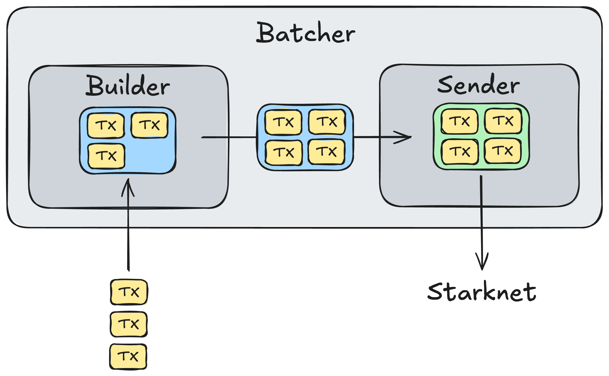

## Abstract

This article presents the transactions batcher used in [Metacube](https://x.com/MetacubeGames) to send NFTs earned by players instantly. It explains the batcher's scalable actor-based architecture and provides a detailed implementation in Go.

All the code snippets are available in the [associated GitHub repository](https://github.com/metacube-games/starknet-batcher).

## Architecture



The Batcher is composed of two main actors:

- The **Builder** receives the transactions, batches them into a single [multicall](https://docs.argent.xyz/aa-use-cases/multicalls) transaction, and sends it to the Sender actor.
- The **Sender** finalizes the transaction with appropriate fields (nonce, max fee, etc.), signs it, sends it to the Starknet network, and monitors its status.

This actor separation allows for a scalable and efficient batcher. The builder prepares the transactions while the sender sends them, allowing for a continuous and efficient flow of transactions.

## Implementation

The following implementation is specific to Go, but the concepts can easily be adapted to other languages, as the functionalities remain the same.

Moreover, note that this implementation is specific to sending NFTs from the same contract. However, a more generic approach is mentioned later in the article.

Lastly, the code is based on the [starknet.go](https://github.com/NethermindEth/starknet.go) library developed by [Nethermind](https://nethermind.io/).

### Batcher

Let's start with the `Batcher` itself:

```go
type Batcher struct {
	accnt           *account.Account
	contractAddress *felt.Felt
	maxSize         int
	inChan          <-chan []string
	failChan        chan<- []string
}
```

The account (`accnt`) is the one holding the NFTs, it will be used to sign the transactions that transfer them. These NFTs are part of the same contract, hence the `contractAddress` field. The `maxSize` field is the maximum size of a batch, and `inChan` is the channel where the transactions are sent to the Batcher. The `failChan` is used to send back the transactions that failed to be sent.

Note that, in this implementation, the later-called transaction data (`[]string`) is an array of two elements: the recipient address and the NFT ID.

The Batcher runs both the `Builder` and the `Sender` actors concurrently:

```go
type TxnDataPair struct {
	Txn  rpc.BroadcastInvokev1Txn
	Data [][]string
}

func (b *Batcher) Run() {
	txnDataPairChan := make(chan TxnDataPair)

	go b.runBuildActor(txnDataPairChan)
	go b.runSendActor(txnDataPairChan)
}
```

The defined channel `txnDataPairChan` sends the transaction data pairs from the `Builder` to the `Sender`. Each transaction data pair comprises the batch transaction, and the data for each transaction is embedded in it. The data for each transaction is sent with the batch transaction so that the failed transactions can be sent back to the entity that instantiates the Batcher.

### Builder

Let's analyze the Build actor. Note that the code is simplified for better readability ([full code](https://github.com/metacube-games/starknet-batcher)):

```go
// This function builds a function call from the transaction data.
func (b *Batcher) buildFunctionCall(data []string) (*rpc.FunctionCall, error) {
    	// Parse the recipient address
	toAddressInFelt, err := utils.HexToFelt(data[0])
	if err != nil {
		...
	}

    	// Parse the NFT ID
	nftID, err := strconv.Atoi(data[1])
	if err != nil {
		...
	}

    	// The entry point is a standard ERC721 function
    	// https://docs.openzeppelin.com/contracts-cairo/0.20.0/erc721
	return &rpc.FunctionCall{
		ContractAddress: b.contractAddress,
		EntryPointSelector: utils.GetSelectorFromNameFelt(
			"safe_transfer_from",
		),
		Calldata: []*felt.Felt{
			b.accnt.AccountAddress, // from
			toAddressInFelt, // to
			new(felt.Felt).SetUint64(uint64(nftID)), // NFT ID
			new(felt.Felt).SetUint64(0), // data -> None
			new(felt.Felt).SetUint64(0), // extra data -> None
		},
	}, nil
}

// This function builds the batch transaction from the function calls.
func (b *Batcher) buildBatchTransaction(functionCalls []rpc.FunctionCall) (rpc.BroadcastInvokev1Txn, error) {
    	// Format the calldata (i.e., the function calls)
	calldata, err := b.accnt.FmtCalldata(functionCalls)
	if err != nil {
		...
	}

	return rpc.BroadcastInvokev1Txn{
		InvokeTxnV1: rpc.InvokeTxnV1{
			MaxFee:        new(felt.Felt).SetUint64(MAX_FEE),
			Version:       rpc.TransactionV1,
			Nonce:         new(felt.Felt).SetUint64(0), // Will be set by the send actor
			Type:          rpc.TransactionType_Invoke,
			SenderAddress: b.accnt.AccountAddress,
			Calldata:      calldata,
		},
	}, nil
}

// Actual Build actor event loop
func (b *Batcher) runBuildActor(txnDataPairChan chan<- TxnDataPair) {
	size := 0
	functionCalls := make([]rpc.FunctionCall, 0, b.maxSize)
	currentData := make([][]string, 0, b.maxSize)

	for {
        	// Boolean to trigger the batch building
		trigger := false

		select {
        	// Receive new transaction data
		case data, ok := <-b.inChan:
			if !ok {
				...
			}

			functionCall, err := b.buildFunctionCall(data)
			if err != nil {
                		...
			}

			functionCalls = append(functionCalls, *functionCall)
			size++
			currentData = append(currentData, data)

			if size >= b.maxSize {
                		// The batch is full, trigger the building
				trigger = true
			}

        	// We don't want a smaller batch to wait indefinitely to be full, so we set a timeout to trigger the building even if the batch is not full
		case <-time.After(WAITING_TIME):
			if size > 0 {
				trigger = true
			}
		}

		if trigger {
			builtTxn, err := b.buildBatchTransaction(functionCalls)
			if err != nil {
                		...
			} else {
                		// Send the batch transaction to the Sender
				txnDataPairChan <- TxnDataPair{
					Txn:  builtTxn,
					Data: currentData,
				}
			}

            		// Reset variables
			size = 0
			functionCalls = make([]rpc.FunctionCall, 0, b.maxSize)
			currentData = make([][]string, 0, b.maxSize)
		}
	}
}
```

The `runBuildActor` function is the Builder actor's event loop. It waits for transactions to be sent to the Batcher and builds a batch transaction when the batch is full, or a timeout is reached. The batch transaction is then sent to the Sender actor.

### Sender

Let's now analyze the Sender actor. Note that the code is simplified for better readability ([full code](https://github.com/metacube-games/starknet-batcher)):

```go
// Actual Send actor event loop
func (b *Batcher) runSendActor(txnDataPairChan <-chan TxnDataPair) {
	oldNonce := new(felt.Felt).SetUint64(0)

	for {
        	// Receive the batch transaction
		txnDataPair, ok := <-txnDataPairChan
		if !ok {
			...
		}
		txn := txnDataPair.Txn
		data := txnDataPair.Data

        	// Get the current nonce of the sender account
		nonce, err := b.accnt.Nonce(
			context.Background(),
			rpc.BlockID{Tag: "latest"},
			b.accnt.AccountAddress,
		)
		if err != nil {
            		...
		}

        	// It might happen that the nonce is not directly updated if another transaction was sent just before. Therefore, we manually increment it to make sure this new transaction is sent with the correct nonce
		if nonce.Cmp(oldNonce) <= 0 {
			nonce.Add(oldNonce, new(felt.Felt).SetUint64(1))
		}

		txn.InvokeTxnV1.Nonce = nonce

        	// Sign the transaction
		err = b.accnt.SignInvokeTransaction(
			context.Background(),
			&txn.InvokeTxnV1,
		)
		if err != nil {
            		...
		}

        	// Send the transaction to the Starknet network
		resp, err := b.accnt.AddInvokeTransaction(
			context.Background(),
			&txn,
		)
		if err != nil {
            		...
		}

        	// Monitor the transaction status
	statusLoop:
		for {
            		// Wait a bit before checking the status
			time.Sleep(time.Second * 5)

            		// Get the transaction status
			txStatus, err := b.accnt.GetTransactionStatus(
				context.Background(),
				resp.TransactionHash,
			)
			if err != nil {
                		...
			}

            		// Check the execution status
			switch txStatus.ExecutionStatus {
			case rpc.TxnExecutionStatusSUCCEEDED:
				oldNonce = nonce
				break statusLoop
			case rpc.TxnExecutionStatusREVERTED:
                		// A reverted transaction consumes the nonce
				oldNonce = nonce
				...
				break statusLoop
			default:
			}

            		// Check the finality status
			switch txStatus.FinalityStatus {
			case rpc.TxnStatus_Received:
				continue
			case rpc.TxnStatus_Accepted_On_L2, rpc.TxnStatus_Accepted_On_L1:
				oldNonce = nonce
				break statusLoop
			case rpc.TxnStatus_Rejected:
				...
			default:
			}

            		// Loop until the transaction status is determined
		}
	}
}
```

The `runSendActor` function is the sender actor's event loop. It waits for the Builder to send batch transactions, signs them, sends them to the Starknet network, and monitors their status.

A note on fee estimation: one could estimate the fee cost of the batch transaction before sending it. The following code can be added after signing the transaction:

```go
		fee, err := b.accnt.EstimateFee(
			context.Background(),
			[]rpc.BroadcastTxn{txn},
			[]rpc.SimulationFlag{},
			rpc.WithBlockTag("latest"),
		)
		if err != nil {
			...
		}
```

This might be useful to ensure the fee is not too high before sending the transaction. If the estimated fee is higher than expected, one might also need to re-adjust the max fee field of the transaction if the estimated fee is higher than expected. But note that when any change is made to the transaction, it must be signed again!

## Towards a generic batcher

The batcher presented is specific to sending NFTs from the same contract. However, the architecture can easily be adapted to send any type of transaction.

First, the transaction data sent to the Batcher must be more generic and, therefore, contain more information. They must contain the contract address, the entry point selector, and the call data. The `buildFunctionCall` function must then be adapted to parse this information.

One could also go one step further by making the sender account generic. This would require more refactoring, as the transactions must be batched per sender account. However, it is feasible and would allow for a more versatile batcher.

However, remember that premature optimization is the root of all evil. Therefore, if you just need to send NFTs or a specific token such as ETH or STRK, the batcher presented is more than enough.

## CLI tool

The [repository](https://github.com/metacube-games/starknet-batcher) code can be used as a CLI tool to send a bunch of NFTs by batch. The tool is easy to use, and you should be able to adapt it to your needs after reading this article. Please refer to the README for more information.

## Conclusion

I hope that this article helped you to better understand how Metacube sends NFTs to its players. The batcher is a key infrastructure component, and we are happy to share it with the community. If you have any questions or feedback, feel free to comment or [reach out to me](https://bastienfaivre.com). Thank you for reading!
